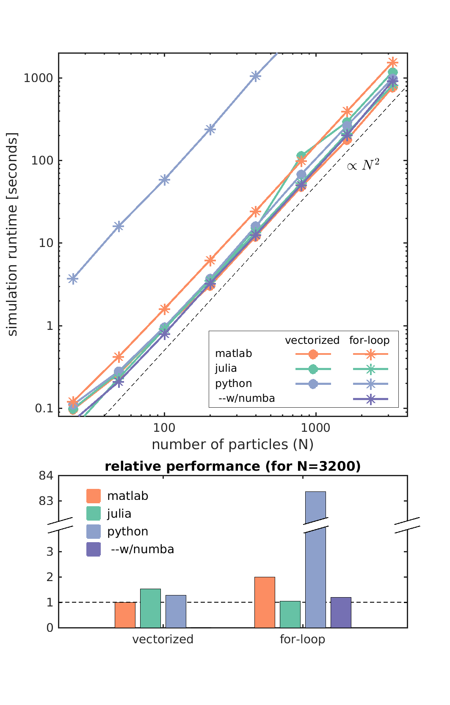

# nbody-performance-comparison
Directly compare performance of vectorized and for-loop implementations of the N-body problem in Matlab, Julia, and Python


### Philip Mocz (2020) Princeton Univeristy, [@PMocz](https://twitter.com/PMocz)

Run the various versions:

```
matlab nbody_vec.m
julia nbody_vec.jl
python nbody_vec.py

matlab nbody_for.m
julia nbody_for.jl
python nbody_for.py

python nbody_for_numba.py
```



## Some Takeaways

* Python for loops are horribly SLOW!! Use **numba** to improve performance. Decorate bottleneck functions with:

```python
from numba import jit

@jit(nopython=True)
def myFunction( myInput ):
```

* Vectorized codes are FAST in all languages, and easier to read. The downside is that they require significantly more memory.


